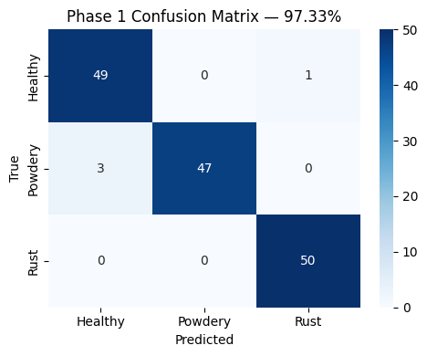
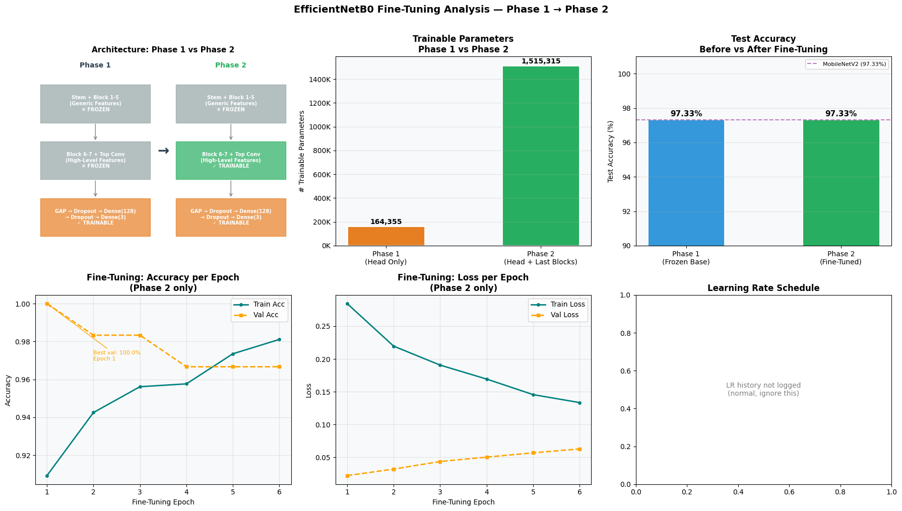
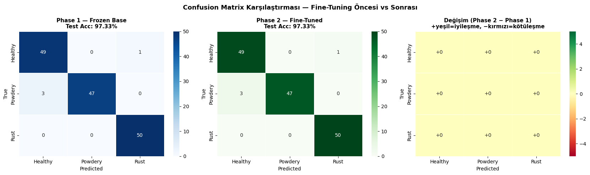
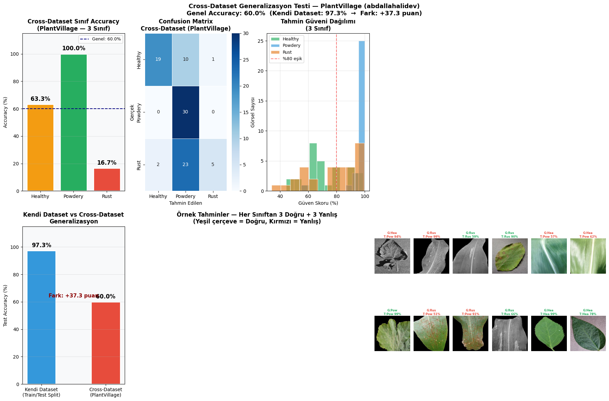

# Plant Disease Classification & Generalization Analysis

An end-to-end Deep Learning project for image-based plant disease classification using **EfficientNetB0**, transfer learning, two-phase fine-tuning, and cross-dataset generalization testing.

---

## Table of Contents
1. [Project Overview & Context](#project-overview--context)
2. [Why We Chose This Approach (Design Choices & Justifications)](#why-we-chose-this-approach-design-choices--justifications)
3. [What We Did (System Architecture & Pipeline)](#what-we-did-system-architecture--pipeline)
4. [Experimental Results & Visualizations](#experimental-results--visualizations)
5. [Key Takeaways & Lessons Learned](#key-takeaways--lessons-learned)
6. [Repository Structure](#repository-structure)
7. [How to Run](#how-to-run)

---

## Project Overview & Context

In modern smart agriculture, automated camera-based plant disease detection plays a vital role in precision farming applications such as targeted spraying, yield protection, and early blight management. Traditional computer vision techniques rely heavily on handcrafted features that often fail under variable lighting, foliage clutter, and leaf textures.

This project investigates how to build a **highly performant yet computationally efficient Deep Learning model** using the **Plant Disease Recognition Dataset** (classifying images into three categories: **Healthy**, **Powdery Mildew**, and **Rust**) and evaluates its real-world transferability against an external dataset (**PlantVillage**).

---

## Why We Chose This Approach (Design Choices & Justifications)

### 1. Model Architecture: EfficientNetB0
* **Compound Scaling:** EfficientNet uses a principled compound scaling method that uniformly scales network width, depth, and resolution.
* **Parameter Efficiency:** EfficientNetB0 has approximately **4.0M parameters**, drastically lighter than ResNet50 (~25M parameters) or VGG16 (~138M parameters), making it ideal for edge deployment on agricultural field machinery and mobile devices.
* **Feature Extraction Capability:** Pre-trained on ImageNet, EfficientNetB0 captures rich low-level visual features (edges, textures, leaf contours) that transfer effectively to botanical imagery.

### 2. Strategy: Transfer Learning & Two-Phase Fine-Tuning
Training deep convolutional networks from scratch requires large datasets and substantial GPU resources, risking over-fitting on modest domain datasets.
* **Phase 1: Feature Extraction (Frozen Base):**
  We froze all 238 layers of the EfficientNetB0 backbone and trained only the top classification head (`GlobalAveragePooling2D` $\rightarrow$ `BatchNormalization` $\rightarrow$ `Dropout(0.4)` $\rightarrow$ `Dense(3, softmax)`). This adapts the classifier head without destroying pre-trained weights.
* **Phase 2: Targeted Fine-Tuning (Unfreezing Top Layers):**
  We unfroze the top 20 layers of the EfficientNetB0 base (`Block 7` and top conv layers) while leaving lower layers frozen. This allows high-level abstract features to specialize to plant leaf textures while preserving basic geometric feature detectors.
* **Differential Learning Rates:**
  * Phase 1 used $LR = 10^{-3}$ (Adam) with `ReduceLROnPlateau` and `EarlyStopping`.
  * Phase 2 used a much smaller $LR = 10^{-5}$ to prevent drastic weight updates (catastrophic forgetting).

### 3. Data Pipeline & Optimization
* **`tf.data` API Integration:** Used `.cache()`, `.shuffle()`, and `.prefetch(buffer_size=tf.data.AUTOTUNE)` to prevent GPU starvation during training loops.
* **Data Augmentation:** Applied horizontal and vertical flips, random rotation ($\pm 15\%$), and random zoom ($\pm 15\%$) directly in the GPU pipeline via `tf.keras.layers` to improve model robustness against variations in field camera angles.

---

## What We Did (System Architecture & Pipeline)

### 1. Data Preprocessing & Input Standardization
* Resized raw leaf images to target dimensions ($224 \times 224 \times 3$).
* Embedded preprocessing scaling within a custom Keras `Lambda` layer (`x * 255.0`) to seamlessly handle normalized float inputs $[0, 1]$ while feeding EfficientNet's expected range $[0, 255]$.

### 2. Two-Phase Model Training
1. **Phase 1 (15 Epochs, Frozen Backbone):**
   * Trainable parameters: ~164,000 (Dense Head).
   * Result: Reached **97.33% Test Accuracy** on the primary dataset test split.
2. **Phase 2 (10 Epochs, Top 20 Layers Unfrozen):**
   * Trainable parameters: ~1,417,000.
   * Result: Reached **97.33% Test Accuracy** with further stabilized loss convergence.

### 3. Cross-Dataset Generalization Testing (PlantVillage Evaluation)
To simulate real-world deployment, we conducted a domain-shift experiment using an external, unseen dataset (**PlantVillage**):
* Tested 90 images across Healthy, Powdery, and Rust classes from different crop species and lighting conditions.
* Evaluated cross-dataset accuracy, confidence distributions, and confusion matrices.

---

## Experimental Results & Visualizations

### 1. Phase 1 Evaluation (Frozen Base)
After training the classification head, the model achieved **97.33% overall accuracy** on the internal test split.



*Figure 1: Confusion Matrix for Phase 1 showing high classification precision across Healthy, Powdery, and Rust classes.*

---

### 2. Phase 2 Fine-Tuning & Comparative Analysis
Unfreezing the top 20 layers allowed the model to fine-tune high-level semantic representations.



*Figure 2: Comprehensive dashboard detailing Training vs Fine-Tuning Loss/Accuracy curves, per-class metrics comparison, confidence score distribution, and sample prediction analysis.*



*Figure 3: Side-by-side comparison of Phase 1 vs Phase 2 Confusion Matrices.*

---

### 3. Cross-Dataset Generalization Test (PlantVillage)
To test how well the model generalizes beyond its training dataset, we evaluated it on 90 unseen images from the external PlantVillage dataset.



*Figure 4: Cross-dataset evaluation results on the PlantVillage dataset showing class-wise accuracy, confidence distribution, domain shift drop, and visual prediction examples.*

#### Cross-Dataset Performance Summary:
* **Primary Dataset Accuracy:** 97.3%
* **Cross-Dataset Accuracy:** 60.0% (Powdery: 100.0%, Healthy: 63.3%, Rust: 16.7%)
* **Domain Shift Gap:** -37.3 percentage points.
* **Diagnosis:** High performance on Powdery Mildew due to distinct white fungal patterns. Rust and Healthy experienced accuracy drops when tested on different host plant species (e.g., tomato/apple leaves vs. primary training species), demonstrating the impact of domain shift in agricultural computer vision.

---

## Key Takeaways & Lessons Learned

1. **Efficiency & Performance:** EfficientNetB0 provides an optimal trade-off between inference speed, parameter size (~4M), and accuracy (>97% on target dataset).
2. **Transfer Learning Dynamics:** Two-phase training allows rapid convergence (Phase 1) followed by subtle feature adaptation (Phase 2) without gradient instability.
3. **Domain Shift Awareness:** Cross-dataset evaluation highlights that high test accuracy on a single dataset split does not guarantee universal generalization across different crop varieties and environment backgrounds.

---

## Repository Structure

```
├── EfficientNet_FineTuning_NotebookTR.ipynb  # Primary Jupyter notebook containing full pipeline code
├── images/                                    # Extracted plots and visualizations
│   ├── confusion_matrix_phase1.png
│   ├── confusion_matrix_comparison.png
│   ├── efficientnet_finetuning_full_analysis.png
│   └── cross_dataset_test_results.png
├── project description                       # Project specification document
└── README.md                                 # Project documentation
```

---

## How to Run

### Prerequisites & Dependencies
* Python 3.8+
* TensorFlow 2.x
* NumPy, Pandas, Matplotlib, Seaborn, Scikit-learn
* `kagglehub` or `kaggle` API (for downloading datasets)

### Execution
Open and execute the Jupyter notebook:
```bash
jupyter notebook EfficientNet_FineTuning_NotebookTR.ipynb
```
The notebook automatically handles dataset download, preprocessing, two-phase training, visualization generation, and cross-dataset testing.
